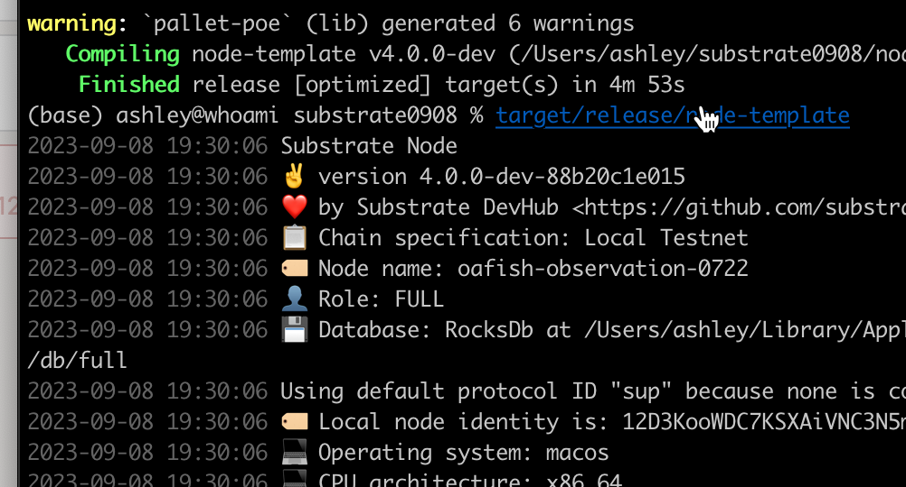

# Substrate Node Template

## Q1 列出3个常用的宏、3个常用的存储数据结构

1. pallet::event, pallet::config, pallet::storage

2. StorageValue, StorageMap, StorageDoubleMap

## Q2 实现存证模块的功能，包括：创建存证；撤销存证。
## Q3 为存证模块添加新的功能，转移存证，接收两个参数，一个是包含的哈希值，另一个是存证的接收账户地址。




```
#![cfg_attr(not(feature = "std"), no_std)]

pub use pallet::*;

#[frame_support::pallet]

pub mod pallet {
    use frame_support::{
		dispatch::DispatchResultWithPostInfo,
		pallet_prelude::*
	};
	use frame_system::pallet_prelude::*;

    #[pallet::config]
	pub trait Config: frame_system::Config {
        // the max length of claim that can be added
        #[pallet::constant]
        type MaxClaimLength: Get<u32>;
        type RuntimeEvent: From<Event<Self>> + IsType<<Self as frame_system::Config>::RuntimeEvent>;
    }

    #[pallet::pallet]
    #[pallet::generate_store(pub(super) trait Store)]
    pub struct Pallet<T>(_);

    #[pallet::storage]
    #[pallet::getter(fn proofs)]
    pub type Proofs<T:Config> = StorageMap<
        _, 
        Blake2_128Concat, 
        BoundedVec<u8, T::MaxClaimLength>, 
        (T::AccountId, BlockNumberFor<T>),
    >;


    #[pallet::event]
  ///  #[pallet::generate_deposit(T::AccountId = "AccountId")]
	#[pallet::generate_deposit(pub(super) fn deposit_event)]
	pub enum Event<T: Config> {
		ClaimCreated(T::AccountId, BoundedVec<u8, T::MaxClaimLength>),
		ClaimRevoked(T::AccountId, BoundedVec<u8, T::MaxClaimLength>),
	}

    #[pallet::error]
    pub enum Error<T> {
        ProofAlreadyExist,
        ClaimTooLong,
        ClaimNotExist,
		NotClaimOwner,
	}

    #[pallet::hooks]
	impl<T:Config> Hooks<BlockNumberFor<T>> for Pallet<T> {}

    #[pallet::call]
	impl<T: Config> Pallet<T> {
        #[pallet::call_index(0)]
		#[pallet::weight(0)]
		pub fn create_claim(
			origin: OriginFor<T>,
			claim: BoundedVec<u8, T::MaxClaimLength>
		) -> DispatchResultWithPostInfo {
			let sender = ensure_signed(origin)?;
			ensure!(!Proofs::<T>::contains_key(&claim), Error::<T>::ProofAlreadyExist);
			Proofs::<T>::insert(&claim, (sender.clone(), frame_system::Pallet::<T>::block_number()));
			Self::deposit_event(Event::ClaimCreated(sender, claim));
			Ok(().into())
		}


        #[pallet::weight(1)]
		pub fn revoke_claim(
			origin: OriginFor<T>,
			claim: BoundedVec<u8, T::MaxClaimLength>,
		) -> DispatchResultWithPostInfo {
			let sender = ensure_signed(origin)?;
			let (owner, _) = Proofs::<T>::get(&claim).ok_or(Error::<T>::ClaimNotExist)?;
			ensure!(sender == owner, Error::<T>::NotClaimOwner);
			Proofs::<T>::remove(&claim);
			Self::deposit_event(Event::ClaimRevoked(sender, claim));
			Ok(().into())
		}

		#[pallet::weight(2)]
		pub fn transfer_claim(
			origin: OriginFor<T>,
			claim: BoundedVec<u8, T::MaxClaimLength>,
			dest: T::AccountId
		) -> DispatchResultWithPostInfo {
			let sender = ensure_signed(origin)?;
			let (owner, _) = Proofs::<T>::get(&claim).ok_or(Error::<T>::ClaimNotExist)?;
			ensure!(sender == owner, Error::<T>::NotClaimOwner);
			Proofs::<T>::insert(&claim, (dest, frame_system::Pallet::<T>::block_number()));
			Self::deposit_event(Event::ClaimRevoked(sender, claim));
			Ok(().into())
		}
	}

}
```
